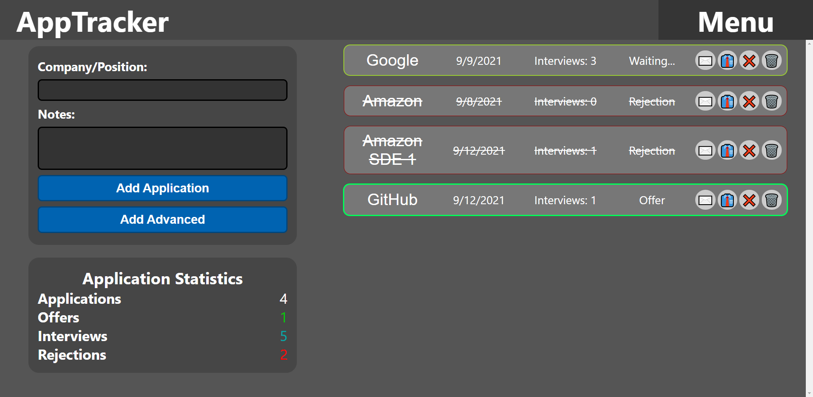
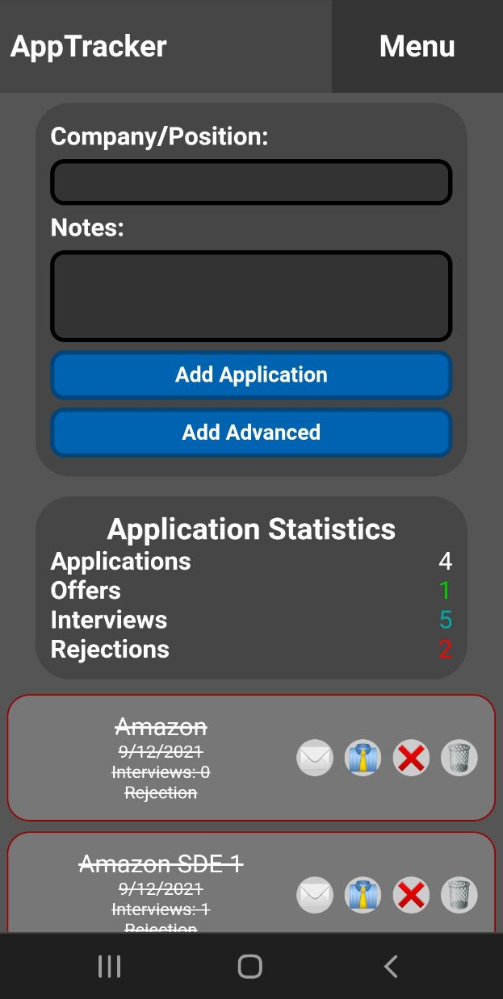

# AppTracker

## About
A simple, user-friendly web application built using React. Allows you to catalog job/internship applications locally in your browser's localstorage. Originally created for myself to document my own internship search.

## Features

### Application Logging
Simply enter a company name and any notes before pressing "Add Application" to catalog it. The following information is stored about applications:
- ID (primary key)
- Company/Position Name
- Notes
- Date
- Number of Interviews
- Offer (boolean)
- Rejection (boolean)

### Application List
A list of applications is displayed to the user, and the user can update interview amount, job offers, rejections, or delete applications using the buttons on the right side of the application card.

### Editing Applications
By clicking on the name of the application, users can edit them through a popup dialog. From this dialog, you can edit Name, Notes, Date, and Number of Interviews.

### Search Statistics
The application also stores information about the application log as a whole. Basic statistics are displayed to the user, including total applications, number of interviews, number of rejections, and number of offers.

### Export/Import Applications
From the dropdown menu, users can export their application list as a JSON file using the "Export Data" button. Similarly, users can import an application list from a JSON file using the "Import Data" button. NOTE: importing applications assigns imported apps a new ID to prevent application overwriting. Imported applications with the same name/ID will not overwrite.

### Theme Support
Both dark and light themes are supported.

### Device Support
Mobile and desktop devices are supported via media queries.

## Images

## License
Distributed under the MIT license.
